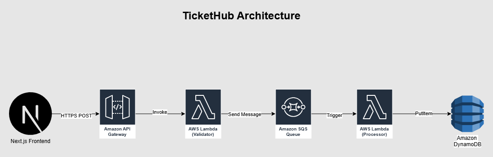

# TicketHub - Cloud-Native Ticketing System

A production-grade serverless application built with Next.js and AWS, demonstrating microservices architecture, event-driven design, and modern DevOps practices.

[](https://tickethub-aws-ui.vercel.app/)
[](https://aws.amazon.com)
[](https://nextjs.org)

---

## 🎯 Project Overview

TicketHub is a fully serverless ticketing platform that processes orders through a multi-stage pipeline with validation, queuing, and persistent storage. Built to demonstrate:

- **Microservices architecture** with independent, scalable components
- **Event-driven processing** using message queues
- **Infrastructure as Code** with automated CI/CD pipelines
- **Cloud-native design** leveraging managed AWS services

**Live Demo:** [https://tickethub-aws-ui.vercel.app/](https://tickethub-aws-ui.vercel.app/)

---

## 🏗️ Architecture



The system follows a serverless microservices pattern:

**Frontend** → **API Gateway** → **Validator Lambda** → **SQS Queue** → **Processor Lambda** → **DynamoDB**

See [Component Repositories](#-component-repositories) for detailed breakdown.

---

## 🛠️ Technology Stack

### Frontend
- **Next.js 15** - React framework with server actions
- **React 19** - Latest React version
- **TailwindCSS 4** - Utility-first styling
- **Vercel** - Deployment and hosting

### Backend (AWS)
- **API Gateway** - HTTP API for public access
- **Lambda** - Serverless compute (Node.js 24)
- **SQS** - Message queue for async processing
- **DynamoDB** - NoSQL database with on-demand scaling
- **CloudWatch** - Logging and monitoring

### DevOps
- **GitHub Actions** - Automated CI/CD pipelines
- **AWS SDK v3** - Modern AWS service clients
- **ESLint** - Code quality enforcement

---

## ✨ Features

✅ **Real-time validation** - Instant feedback on form inputs  
✅ **Async processing** - Non-blocking ticket submission  
✅ **Auto-scaling** - Handles traffic spikes automatically  
✅ **Event-driven** - Loosely coupled microservices  
✅ **CI/CD** - Automated deployments on every push  
✅ **Error handling** - Graceful failure and retry logic  

---

## 📦 Component Repositories

This project is split into focused microservices:

| Component | Description | Repository |
|-----------|-------------|------------|
| **Frontend** | Next.js user interface | [tickethub-aws-ui](https://github.com/romelt777/tickethub-aws-ui) |
| **Validator** | Input validation Lambda | [tickethub-aws-api](https://github.com/romelt777/tickethub-aws-api) |
| **Processor** | Queue processing Lambda | [tickethub-aws-processor](https://github.com/romelt777/tickethub-aws-processor) |

---

## 🚀 Getting Started

### Prerequisites
- Node.js 22+ (AWS Lambda uses Node.js 24 runtime)
- AWS Account
- AWS CLI configured
- GitHub account

### Local Development

**1. Clone all repositories:**
```bash
git clone https://github.com/romelt777/tickethub-aws-ui
git clone https://github.com/romelt777/tickethub-aws-api.git
git clone https://github.com/romelt777/tickethub-aws-processor.git
```

**2. Set up frontend:**
```bash
cd tickethub-aws-ui
npm install
# Create .env.local with API Gateway URL
npm run dev
```

**3. Test Lambda functions locally:**
```bash
cd tickethub-aws-api
npm install
# Create .env with QUEUE_URL
node test-local.js
```

See individual repository READMEs for detailed setup instructions.

---

## 🔧 AWS Infrastructure Setup

### 1. Create SQS Queue
```bash
aws sqs create-queue --queue-name tickethub-queue
```

### 2. Create DynamoDB Table
```bash
aws dynamodb create-table \
  --table-name Tickets \
  --attribute-definitions AttributeName=ticketId,AttributeType=S \
  --key-schema AttributeName=ticketId,KeyType=HASH \
  --billing-mode PAY_PER_REQUEST
```

### 3. Deploy Lambda Functions
Push to `main` branch - GitHub Actions handles deployment automatically.

### 4. Configure API Gateway
- Create HTTP API
- Add POST /tickets route
- Link to validator Lambda
- Enable CORS

---

## 📊 System Flow

1. **User submits form** on Next.js frontend
2. **API Gateway** receives HTTP POST request
3. **Validator Lambda** validates input data
   - ✅ Valid → Sends to SQS queue, returns 200
   - ❌ Invalid → Returns 400 with error array
4. **SQS Queue** holds message until processor is ready
5. **Processor Lambda** triggered by SQS, writes ticket to DynamoDB
6. **SQS** deletes message (on success) or retries (on failure)

---

## 🧪 Testing

### End-to-End Test
```bash
curl -X POST https://bu0la6i3uj.execute-api.us-east-1.amazonaws.com/tickets \
  -H "Content-Type: application/json" \
  -d '{
  "id": 333,
  "email": "user@example.com",
  "name": "CURLTEST",
  "phone": "5091118186",
  "quantity": 333,
  "creditCard": "4242424242424242",
  "expirationDate": "09/29",
  "securityCode": "511",
  "address": "123 Main Street",
  "city": "Village Municipality",
  "province": "NS",
  "postalCode": "90210",
  "country": "Canada"
}'
```

### Check DynamoDB
```bash
aws dynamodb scan --table-name Tickets
```

---

## 📈 Future Enhancements

- [ ] Cost monitoring dashboard (CloudWatch metrics)
- [ ] Email confirmations (SES integration)
- [ ] Admin panel to view tickets
- [ ] User authentication (Cognito)
- [ ] Multi-region deployment
- [ ] Dead letter queue for failed messages
