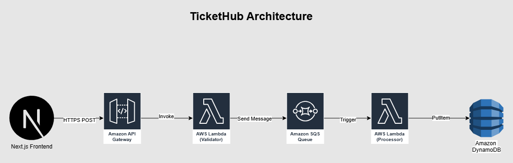

# TicketHub - Cloud-Native Ticketing System

TicketHub is a serverless ticket submission system built with Next.js and AWS. It demonstrates asynchronous processing using API Gateway, Lambda, SQS, and DynamoDB, with automated CI/CD deployments through GitHub Actions.

---

**Live Demo:** [https://tickethub-aws-ui.vercel.app/](https://tickethub-aws-ui.vercel.app/)

## Project Overview

When a user submits a ticket from the frontend, API Gateway receives the HTTP request and invokes a validation Lambda. If the payload is invalid, the function returns a 400 response with validation errors. If valid, the entire ticket JSON object is sent to SQS. A separate processor Lambda is triggered by SQS and writes the ticket to DynamoDB. If processing fails, SQS automatically retries the message based on its retry policy.

This design separates validation from persistence and enables asynchronous processing so the API does not block while tickets are written to the database.

---

## Architecture

**Frontend** → **API Gateway** → **Validator Lambda** → **SQS Queue** → **Processor Lambda** → **DynamoDB**

See [Component Repositories](#-component-repositories) for detailed breakdown.

---

## Technology Stack

Tech stack used:

Frontend:
- Next.js 15
- React 19
- TailwindCSS
- Vercel (deployment)

Backend (AWS):
- API Gateway (HTTP API)
- AWS Lambda (Node.js runtime)
- Amazon SQS
- Amazon DynamoDB
- CloudWatch (logging)

DevOps:
- GitHub Actions (CI/CD)
- AWS SDK v3

---

Implementation details:
- Validation and persistence are handled by separate Lambda functions.
- Ticket data is passed through SQS as a JSON message.
- DynamoDB is used as the persistence layer.
- CI/CD pipelines deploy backend services automatically on push to main.
- CloudWatch logs are used to monitor Lambda execution and errors.

---

## Component Repositories

| Component | Description | Repository |
|-----------|-------------|------------|
| **Frontend** | Next.js user interface | [tickethub-aws-ui](https://github.com/romelt777/tickethub-aws-ui) |
| **Validator** | Input validation Lambda | [tickethub-aws-api](https://github.com/romelt777/tickethub-aws-api) |
| **Processor** | Queue processing Lambda | [tickethub-aws-processor](https://github.com/romelt777/tickethub-aws-processor) |

---

Planned improvements include adding a dead-letter queue for failed messages, email confirmations using SES, user authentication with Cognito, an admin dashboard for viewing tickets, and monitoring for queue depth and processing metrics.
