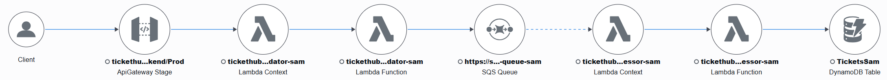
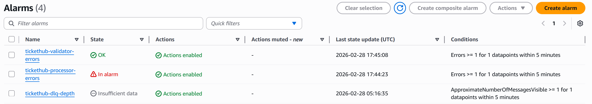

# TicketHub - Serverless Ticketing System

TicketHub is a ticket submission app. The frontend is Next.js, the backend uses AWS services, with Lambda handling the core application logic. The infrastructure is defined using AWS SAM, so everything can be recreated and deployed from code.

---

**Live Demo:** https://tickethub-aws-frontend.vercel.app/

---

## Repositories

- **Frontend:** https://github.com/romelt777/tickethub-aws-frontend
- **Backend:** https://github.com/romelt777/tickethub-backend  

---

## How it works

When a user submits a ticket, the request goes through API Gateway which triggers a validation Lambda. 

The Lambda checks the input and returns a `400` response if validation fails.  
If the input is valid, the ticket is sent to an SQS queue.

A separate Lambda processes messages from the queue and writes the ticket to DynamoDB.

If processing fails, SQS automatically retries the message up to three times. After that, the message is moved to a Dead-Letter Queue so it can be inspected and replayed.

---

## Architecture

**Frontend → API Gateway → Validator Lambda → SQS Queue → Processor Lambda → DynamoDB**

If a message fails processing after three retries, it is moved to a Dead-Letter Queue.

---

## Tech Stack

**Frontend**
- Next.js 15, Typescript, React 19, TailwindCSS
- Deployed on Vercel

**Backend**
- API Gateway
- AWS Lambda (Node.js)
- Amazon SQS with Dead-Letter Queue
- Amazon DynamoDB
- AWS X-Ray for tracing
- Amazon CloudWatch (metrics + alarms)

**DevOps**
- AWS SAM (infrastructure as code)
- AWS SDK v3

---

## Infrastructure as Code

All backend resources are defined in a single SAM `template.yaml` file, including:

- Lambda functions  
- API Gateway  
- SQS and Dead-Letter Queue  
- DynamoDB  
- IAM permissions
- CloudWatch alarms

---

## Tracing

AWS X-Ray tracing is enabled across the full request flow.

This lets me see how a request moves through API Gateway, both Lambda functions, the SQS queue, and finally DynamoDB. It’s helpful for understanding latency between services and debugging failures.



---

## Monitoring & Alerts

Three CloudWatch alarms watch the backend and email me via SNS if something breaks:

- Validator errors: fires if the validator Lambda crashes or times out
- Processor errors: fires if the processor Lambda fails while writing a ticket to DynamoDB
- DLQ depth: fires if a message lands in the dead-letter queue, meaning it failed all 3 retries



---

## Deploying the Backend

### Prerequisites
- AWS credentials configured 
- AWS SAM CLI installed

### 1. Clone the repository

```bash
git clone https://github.com/romelt777/tickethub-backend.git
cd tickethub-backend
```

### 2. Configure parameter (AWS SSM) for alarms

```bash
aws ssm put-parameter --name "/tickethub/alarm-email" --value "youremail@hotmail.com" --type SecureString
```

### 3. Build and deploy with SAM

```bash
sam build
sam deploy --guided
```

---

## What's next

Things I’d like to add or improve:

- Email confirmations using SES  
- Authentication with Cognito  
- A simple admin dashboard for managing tickets  
